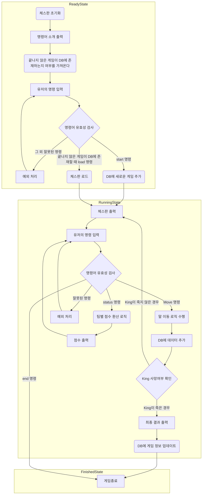

# 우테코 5기 1레벨 6~7주차 - 체스 게임&Lambda, Stream 활용하기 미니 미션


> 우아한테크코스 5기 1레벨 6~7주차 미션, 체스 게임 미션과 Lambda&Stream 활용하기 미니 미션을 구현한 저장소입니다.


# 목차
- [시작하기](#시작하기)
- [도메인 모델 네이밍 사전](#도메인-모델-네이밍-사전)
- [프로그램 흐름도](#프로그램-흐름도)
- [기능 목록](#기능-목록)
  - [입력](#입력)
  - [비즈니스 로직](#비즈니스-로직)
  - [출력](#출력)
  - [DB](#db)


## 시작하기
먼저 해당 레포지토리를 Clone합니다.
```
git clone -b as https://github.com/amaran-th/java-chess.git
```
- DB 셋팅
1. [Docker Download](https://docs.docker.com/install/)를 통해 각 OS에 맞게 Docker를 설치한다.
2. docker-compose.yml 파일이 있는 java-chess/db 경로로 이동하여 다음 명령어로 도커 서버 실행
```
docker-compose -p chess up -d
```
3. 서버가 실행중인 상태에서 src/main/java에 위치한 Application.java 파일을 실행시키면 프로그램을 동작시킬 수 있습니다.

## 도메인 모델 네이밍 사전
| 한글명   | 영문명       | 설명                               | 분류               |
|---------|-------------|-----------------------------------|-------------------|
| 팀     | Team      | Black, White로 구별되는 팀 정보          | enum             |
| 로그    | Log       | 기물이 이동 명령을 받았을 떄의 위치와 게임 턴 수를 저장 | class            |
| 기록    | Trace     | 로그의 목록                           | class            |
| 기물    | Piece     | 체스판의 말                           | (abstract) class |
| 행     | File      | 체스판의 세로 위치 정보 (1 ~ 8)            | enum             |
| 열     | Rank      | 체스판의 가로 위치 정보 (a ~ h)            | enum             |
| 이동 범위 | MoveRange | 말이 이동할 수 있는 유형            | enum             |
| 좌표    | Position  | 행과 열로 이루어진 체스판의 위치정보             | class            |
| 칸     | Square    | 좌표와 기물 정보를 가지고 있는 체스판의 구성요소      | class            |
| 턴     | Turn      | 체스 게임의 턴                         | class            |
| 체스 판  | ChessBoard | 칸을 가지고 있는 보드            | class            |
| 체스 판 생성기  | ChessBoardFactory | 체스 판을 초기화한다.                  | class            |
| 게임 상태 | GameState | 체스 게임의 상태                        | interface             |
| 체스 게임 | ChessGame | 체스 게임 진행을 관리                     | class            |
| 점수 | Score | 팀의 점수                                      | class            |
| 점수 계산기 | ScoreCalculator | 팀의 점수를 계산해서 반환한다.            | interface            |


## 프로그램 흐름도


## 기능 목록
### 입력
- 게임 시작 전 명령을 입력 받는다.
    - 새 게임 명령 : start로 새 게임을 실행한다.
    - 불러오기 명령 : load로 이전에 중단된 게임을 이어한다.
- 게임 중 명령을 입력 받는다.
    - 이동 명령 : move source위치 target위치을 실행해 이동한다.
    - 종료 명령 : end로 프로그램을 종료한다.
    - 상태 확인 명령 : status 명령을 받으면 각 진영의 점수를 출력하고 어느 진영이 이겼는지 결과를 볼 수 있어야 한다.


### 비즈니스 로직
- 체스 게임(ChessGame)
    - 게임의 턴 정보를 가진다.
      - 게임 중 이동 명령이 정상적으로 수행되면 턴을 증가시킨다.
    - 시작 명령을 받으면 게임을 시작한다.
      - 데이터베이스에 새 게임 데이터를 추가한다.
      - 게임을 Running 상태로 전환한다.
    - 로드 명령을 받으면 게임의 진행 기록을 불러와 체스판을 초기화한다.
      - 초기화가 끝나면 Running 상태로 전환한다.
    - 이동 명령을 받으면 체스판에 명령을 전달한다.
      - 데이터베이스에 이동 기록을 저장한다.
    - 종료 명령을 받으면 게임을 종료한다.
    - 킹이 잡히면 게임을 종료한다.
-  점수(Score)(값객체)
    - equals 구현
    - 더하기 구현
- 점수 계산기(ScoreCalculator)
    - 점수 상으로 이긴 팀을 구한다.
    - 특정 팀의 열 별 점수를 구한다.
      - 폰의 경우, 같은 열에 같은 팀의 폰이 존재하면 0.5점으로 계산한다.
- 게임의 상태(GameState)
    - ReadyState 준비 상태
    - RunningState 게임이 진행되고 있는 상태
    - FinishedState 게임이 중단/종료된 상태
- 체스판공장(ChessBoardFactory)
    - 체스판의 초기 상태를 초기화한다.
- 체스판(ChessBoard)
  - 체스판을 초기화한다.
      - 체스판은 64개의 칸으로 이루어져 있다.
      - 각 칸은 자신의 기물정보와 위치정보를 초기화한다.
          - 칸은 a ~ h 의 File과 1 ~ 8 의 Rank의 Position을 가진다.
      - 체스판은 이동 또는 공격을 수행한다.
          - 체스판은 이동 또는 공격이 가능한지 확인한다.
          - 입력받은 두 칸의 기물을 변경한다.
          - 이동 기록(Log)을 기물에 추가한다.
  - 팀과 점수 계산기 객체를 입력으로 받아 해당 팀의 점수를 계산한다.
  - 폰 기물의 앙 파상 동작을 구현한다.(공격 로직)
- 기물(Piece)
  - 기물의 이동 가능 여부를 판단한다.
      - 모든 기물은 자기 자신의 위치로 이동할 수 없다.
      - 킹은 주변 8방향으로 1칸 범위에서 이동 가능하다.
      - 퀸은 주변 8방향으로 칸 제한없이 이동 가능하다.
      - 룩은 상하좌우로 칸 제한없이 이동 가능하다.
      - 비숍은 대각선으로 칸 제한없이 이동 가능하다.
      - 나이트는 상하좌우로 두 칸 움직인 후 꺾어서 한 칸인 위치로 이동가능하다.
      - 폰 이동과 공격이 분리된다.
        - 이동
          - 한 번도 움직이지 않았다면 두 칸 앞으로 이동할 수 있다.
          - 한 칸 앞으로 이동할 수 있다.
        - 공격
          - 앞으로 한 칸 움직인 후 옆으로 꺾어서 한 칸인 위치에 상대방의 기물이 있다면 공격할 수 있다.
      - 자신의 점수를 반환한다.

### 출력
- 게임의 명령어 가이드를 출력한다.
- 현재 체스 판의 정보를 출력한다.
    - 체스판에서 각 진영은 검은색(대문자)과 흰색(소문자)편으로 구분한다.
- 각 팀의 점수를 출력한다.
- 게임 종료 후 어느 팀이 승리하였는지에 대한 정보를 출력한다.

### DB
- 새 게임을 game에 저장하는 기능
- 미완료 상태의 game 엔티티를 (하나만)불러오는 기능
- 경로 하나를 moveHistory에 저장하는 기능
- game 하나의 moveHistory 엔티티들을 불러와 List로 반환하는 기능
- 체스 게임 정보를 업데이트하는 기능
    - game 엔티티의 상태 및 승자 정보 변경
